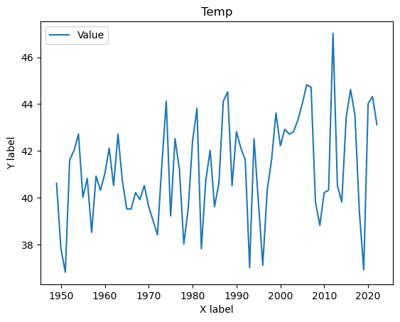

---

# Get started with open reproducible science!

[Open reproducible science](https://www.earthdatascience.org/courses/intro-to-earth-data-science/open-reproducible-science/get-started-open-reproducible-science/) makes scientific methods, data and outcomes available to everyone. That means that *everyone* who wants should be able to **find**, **read**, **understand**, and **run** your workflows for themselves.


 > Image from https://www.earthdata.nasa.gov/esds/open-science/oss-for-eso-workshops

Few if any science projects are 100% open and reproducible (yet!). However, members of the open science community have developed open source tools and practices that can help you move toward that goal. You will learn about many of those tools in [the Intro to Earth Data Science textbook](https://www.earthdatascience.org/courses/intro-to-earth-data-science/). Don't worry about learning all the tools at once -- we've picked a few for you to get started with.

1. Open reproducible science is research releated information that is shared openly allowing anyone to reprodce the said research. 
2. Git/GitHub allows you to store your code related to your research for future usage or allowing for easy accessibility to anyone you wish to share with.
3. No. If the spaces were placed with dashes - or underscores _ it would be considered a machine-readable name.

I can write clean code by:
  * `Including the usage of #text_here`
  * `Naming variables something that is understandable and relevant`


Advantages of clean code include:
  * `code becomes understandable to those who have not contributed to the code`
  * `makes the code easily reproducible`


```python
#can't get this to work :(
import pandas as pd


```

Once you have run the cell above and imported `pandas`, **run the cell below**. It is a test cell that will tell you if you completed the task successfully. If a test cell isn't working the way you expect, check that you ran your code **immediately before** running the test.


```python
# DO NOT MODIFY THIS TEST CELL
points = 0
try:
    pd.DataFrame()
    points += 5
    print('\u2705 Great work! You correctly imported the pandas library.')
except:
    print('\u274C Oops - pandas was not imported correctly.')
print('You earned {} of 5 points for importing pandas'.format(points))
```

    ✅ Great work! You correctly imported the pandas library.
    You earned 5 of 5 points for importing pandas


* Who takes the data 
    * `NOAA's Global Surface Temperature Analysis (NOAAGlobalTemp)`
* Data is taken from 
    * `GHCNm (Global Historical Climatology Network-Monthly: dataset provides monthly climate summaries from thousands of weather stations around the world)`
    * `ERSST (Extended Reconstructed Sea Surface Temperature: dataset is a global monthly analysis of SST data derived from the International Comprehensive Ocean–Atmosphere Dataset (ICOADS))`
* The maximum temperature units are
    * 63 F
    * 17.2 C
* How the data are collected
    * NCEI uses GHCN monthly to monitor long-term trends in temperature and precipitation. Weather stations

*Citation*
* NOAA National Centers for Environmental information, Climate at a Glance: City Time Series, published May 2023, retrieved on May 25, 2023 from https://www.ncei.noaa.gov/access/monitoring/climate-at-a-glance/city/time-series


```python
test_url = ('https://www.ncei.noaa.gov/access/monitoring/'
            'climate-at-a-glance/city/time-series/'
            'USW00024090/tmax/ann/2/1949-2023.csv')
test_url
```


    'https://www.ncei.noaa.gov/access/monitoring/climate-at-a-glance/city/time-series/USW00024090/tmax/ann/2/1949-2023.csv'


```python
# DO NOT MODIFY THIS TEST CELL
resp_url = _
points = 0

if type(resp_url)==str:
    points += 3
    print('\u2705 Great work! You correctly called your url variable.')
else:
    print('\u274C Oops - your url variable was not called correctly.')

if len(resp_url)==117:
    points += 3
    print('\u2705 Great work! Your url is the correct length.')
else:
    print('\u274C Oops - your url variable is not the correct length.')

print('You earned {} of 6 points for defining a url variable'.format(points))
```

    ✅ Great work! You correctly called your url variable.
    ✅ Great work! Your url is the correct length.
    You earned 6 of 6 points for defining a url variable


```python
#downloading the data from url, and formating the table so that the data and value are not apart of the data, only the heading.
dataframe = pd.read_csv(test_url, 
                        header=3, 
                        names=['Date', 'Value'])

dataframe
```


<div>
<style scoped>
    .dataframe tbody tr th:only-of-type {
        vertical-align: middle;
    }

    .dataframe tbody tr th {
        vertical-align: top;
    }

    .dataframe thead th {
        text-align: right;
    }
</style>
<table border="1" class="dataframe">
  <thead>
    <tr style="text-align: right;">
      <th></th>
      <th>Date</th>
      <th>Value</th>
    </tr>
  </thead>
  <tbody>
    <tr>
      <th>0</th>
      <td>194912</td>
      <td>58.4</td>
    </tr>
    <tr>
      <th>1</th>
      <td>195012</td>
      <td>55.6</td>
    </tr>
    <tr>
      <th>2</th>
      <td>195112</td>
      <td>54.6</td>
    </tr>
    <tr>
      <th>3</th>
      <td>195212</td>
      <td>59.4</td>
    </tr>
    <tr>
      <th>4</th>
      <td>195312</td>
      <td>59.8</td>
    </tr>
    <tr>
      <th>...</th>
      <td>...</td>
      <td>...</td>
    </tr>
    <tr>
      <th>69</th>
      <td>201812</td>
      <td>57.2</td>
    </tr>
    <tr>
      <th>70</th>
      <td>201912</td>
      <td>54.7</td>
    </tr>
    <tr>
      <th>71</th>
      <td>202012</td>
      <td>61.8</td>
    </tr>
    <tr>
      <th>72</th>
      <td>202112</td>
      <td>62.1</td>
    </tr>
    <tr>
      <th>73</th>
      <td>202212</td>
      <td>60.9</td>
    </tr>
  </tbody>
</table>
<p>74 rows × 2 columns</p>
</div>


```python
# DO NOT MODIFY THIS TEST CELL
tmax_df_resp = _
points = 0

if isinstance(tmax_df_resp, pd.DataFrame):
    points += 1
    print('\u2705 Great work! You called a DataFrame.')
else:
    print('\u274C Oops - make sure to call your DataFrame for testing.')
    
summary = [round(val, 2) for val in tmax_df_resp.mean().values]
if summary == [198562.0, 58.89]:
    points += 4
    print('\u2705 Great work! You correctly downloaded data.')
else:
    print('\u274C Oops - your data are not correct.')
print('You earned {} of 5 points for downloading data'.format(points))
```

    ✅ Great work! You called a DataFrame.
    ❌ Oops - your data are not correct.
    You earned 1 of 5 points for downloading data


  > HINT: Check out the `type()` function below - you can use it to check that your data is now in `DataFrame` type object


```python
# Check that the data was imported into a pandas DataFrame
type(dataframe)
```


    pandas.core.frame.DataFrame


```python
# ncei has wacky years
dataframe.iloc[:,0] = dataframe.iloc[:,0] // 100
dataframe

```


<div>
<style scoped>
    .dataframe tbody tr th:only-of-type {
        vertical-align: middle;
    }

    .dataframe tbody tr th {
        vertical-align: top;
    }

    .dataframe thead th {
        text-align: right;
    }
</style>
<table border="1" class="dataframe">
  <thead>
    <tr style="text-align: right;">
      <th></th>
      <th>Date</th>
      <th>Value</th>
    </tr>
  </thead>
  <tbody>
    <tr>
      <th>0</th>
      <td>1949</td>
      <td>58.4</td>
    </tr>
    <tr>
      <th>1</th>
      <td>1950</td>
      <td>55.6</td>
    </tr>
    <tr>
      <th>2</th>
      <td>1951</td>
      <td>54.6</td>
    </tr>
    <tr>
      <th>3</th>
      <td>1952</td>
      <td>59.4</td>
    </tr>
    <tr>
      <th>4</th>
      <td>1953</td>
      <td>59.8</td>
    </tr>
    <tr>
      <th>...</th>
      <td>...</td>
      <td>...</td>
    </tr>
    <tr>
      <th>69</th>
      <td>2018</td>
      <td>57.2</td>
    </tr>
    <tr>
      <th>70</th>
      <td>2019</td>
      <td>54.7</td>
    </tr>
    <tr>
      <th>71</th>
      <td>2020</td>
      <td>61.8</td>
    </tr>
    <tr>
      <th>72</th>
      <td>2021</td>
      <td>62.1</td>
    </tr>
    <tr>
      <th>73</th>
      <td>2022</td>
      <td>60.9</td>
    </tr>
  </tbody>
</table>
<p>74 rows × 2 columns</p>
</div>


```python
# DO NOT MODIFY THIS TEST CELL
tmax_df_resp = _
points = 0

if isinstance(tmax_df_resp, pd.DataFrame):
    points += 1
    print('\u2705 Great work! You called a DataFrame.')
else:
    print('\u274C Oops - make sure to call your DataFrame for testing.')
    
summary = [round(val, 2) for val in tmax_df_resp.mean().values]
if summary == [1985.5, 58.89]:
    points += 4
    print('\u2705 Great work! You correctly cleaned up years.')
else:
    print('\u274C Oops - your data are not correct.')
print('You earned {} of 5 points for cleaning up years'.format(points))
```

    ✅ Great work! You called a DataFrame.
    ❌ Oops - your data are not correct.
    You earned 1 of 5 points for cleaning up years


 Want an EXTRA CHALLENGE? Modify the code to be **more expressive**.

Rewrite the code below to select columns by **name** instead of by **index**. You might find the [pandas User Guide section on slicing and dicing](https://pandas.pydata.org/docs/user_guide/indexing.html) to be useful. However - don't worry if you can't figure this out yet! We're going to talk a lot about how to use pandas `DataFrame`s. 

YOUR ANSWER HERE


```python
#convert to celcius
dataframe.iloc[:,1] = dataframe.iloc[:,1] - 32 * 5 / 9
dataframe

```


<div>
<style scoped>
    .dataframe tbody tr th:only-of-type {
        vertical-align: middle;
    }

    .dataframe tbody tr th {
        vertical-align: top;
    }

    .dataframe thead th {
        text-align: right;
    }
</style>
<table border="1" class="dataframe">
  <thead>
    <tr style="text-align: right;">
      <th></th>
      <th>Date</th>
      <th>Value</th>
    </tr>
  </thead>
  <tbody>
    <tr>
      <th>0</th>
      <td>1949</td>
      <td>40.622222</td>
    </tr>
    <tr>
      <th>1</th>
      <td>1950</td>
      <td>37.822222</td>
    </tr>
    <tr>
      <th>2</th>
      <td>1951</td>
      <td>36.822222</td>
    </tr>
    <tr>
      <th>3</th>
      <td>1952</td>
      <td>41.622222</td>
    </tr>
    <tr>
      <th>4</th>
      <td>1953</td>
      <td>42.022222</td>
    </tr>
    <tr>
      <th>...</th>
      <td>...</td>
      <td>...</td>
    </tr>
    <tr>
      <th>69</th>
      <td>2018</td>
      <td>39.422222</td>
    </tr>
    <tr>
      <th>70</th>
      <td>2019</td>
      <td>36.922222</td>
    </tr>
    <tr>
      <th>71</th>
      <td>2020</td>
      <td>44.022222</td>
    </tr>
    <tr>
      <th>72</th>
      <td>2021</td>
      <td>44.322222</td>
    </tr>
    <tr>
      <th>73</th>
      <td>2022</td>
      <td>43.122222</td>
    </tr>
  </tbody>
</table>
<p>74 rows × 2 columns</p>
</div>


```python
# DO NOT MODIFY THIS TEST CELL
tmax_df_resp = _
points = 0

if isinstance(tmax_df_resp, pd.DataFrame):
    points += 1
    print('\u2705 Great work! You called a DataFrame.')
else:
    print('\u274C Oops - make sure to call your DataFrame for testing.')
    
summary = [round(val, 2) for val in tmax_df_resp.mean().values]
if summary == [1985.5, 58.89, 14.94]:
    points += 4
    print('\u2705 Great work! You correctly converted to Celcius.')
else:
    print('\u274C Oops - your data are not correct.')
print('You earned {} of 5 points for converting to Celcius'.format(points))
```

    ✅ Great work! You called a DataFrame.
    ❌ Oops - your data are not correct.
    You earned 1 of 5 points for converting to Celcius


 Want an **EXTRA CHALLENGE**?
  1. As you did above, rewrite the code to be more expressive
  2. Using the code below as a framework, write and apply a **function** that converts to Celcius.
     > **Functions** let you reuse code you have already written
  
  3. You should also rewrite this function name to be more expressive.
  
        ```python
        def convert(temperature):
            """Convert temperature to Celcius"""
            return temperature # Put your equation in here

        dataframe['temp_c'] = dataframe['temp_f'].apply(convert)
        ```


```python
dataframe.plot(x='Date', y='Value',
               title='Temp',
               ylabel="Y label", xlabel="X label")


```


    <Axes: title={'center': 'Temp'}, xlabel='X label', ylabel='Y label'>


    

    


**THIS ISN'T THE END! Don't forget to complete the next task where you will describe your plot**
    


> Image source: https://www.nps.gov/pais/learn/nature/hatchlingreleases.htm

 Want an **EXTRA CHALLENGE**?

There are many other things you can do to customize your plot. Take a look at the [pandas plotting galleries](https://pandas.pydata.org/docs/user_guide/visualization.html) and the [documentation of plot](https://pandas.pydata.org/docs/reference/api/pandas.DataFrame.plot.html) to see if there's other changes you want to make to your plot. Some possibilities include:
  * Remove the legend since there's only one data series
  * Increase the figure size
  * Increase the font size
  * Change the colors
  * Use a bar graph instead (usually we use lines for time series, but since this is annual it could go either way)
  * Add a trend line

## YOUR RAPID CITY PLOT HEADLINE HERE
Describe your plot in this cell in 2-3 sentences

**THIS ISN'T THE END EITHER! Don't forget to reproduce your analysis in a new location!**


> Image source: https://www.independent.co.uk/climate-change/news/by-the-left-quick-march-the-emperor-penguins-migration-1212420.html

## Your turn: pick a new location and/or measurement to plot
Below, recreate the workflow you just did in a place that interests you OR with a different measurement. See the instructions above fore how to get your URL. You will need to make your own new Markdown and Code cells below this one.
